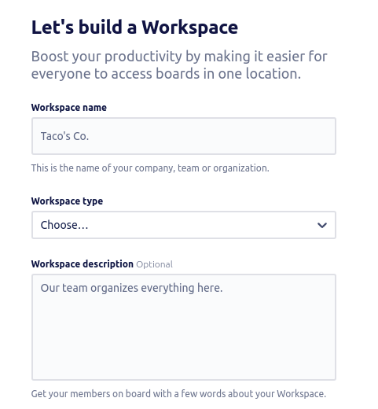
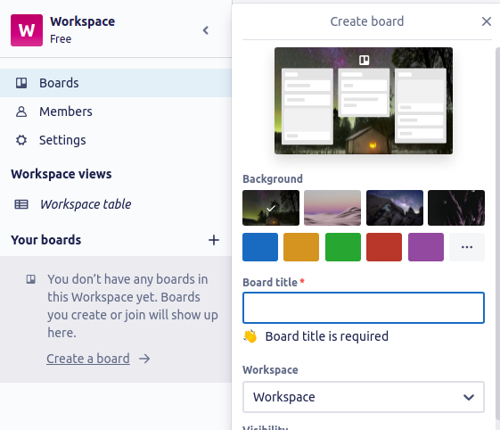

# **Trello-SpaceX API**
---
## Setup
1. create a Trello Account at `https://trello.com/`
---
2. generate an API and a TOKEN keys to be able to use this API
`https://trello.com/app-key`
---
3. create a workspace in the Trello main page

---
4. once you have created your workspace, you must create a new **Board** and select the corresponding workspace 

---
5. congrats, you have created your Board, now, you have to clone this github repository
```python
git clone https://github.com/guidoenr/spacex
```
---
6. the next step is to open the config file called `conf.py` with your favorite text editor.
you will see a file like the following:
```python
# please, complete with the data in : https://trello.com/app-key
credentials = {
    "private": {
        "api_key": "",
        "token": "",
        "id_board": "",
    }
}

# please, complete with the data in : https://trello.com/b/WFPZ8fIc/<BOARD_NAME>.json
workspace = {
    "lists": {
        "id_doing": "",
        "id_done": "", 
        "id_todo": "",
        
    },
    "labels": {
        "id_bug": "",
        "id_issue": "",
        "id_maintenance": "",
        "id_research": "",
        "id_task": "",
        "id_test": "",
    }    
}
```
---
7. as you see, at this step you only have the `credentials` but not the id_board, so please fill all the "private" values with your `api-key` and your `token`. the file will be look like this:
```python
credentials = {
    "private": {
        "api_key": "secret_api_key142130a",
        "token": "secret_token_124741921",
        "id_board": "",
    }
}

...
..
.
```
then, save the file

---
8. once you putted all the private data in the `conf.py` file, please run the **init_trello.py** script to fill your board settings like the labels, lists, etc.. \
*I recommend to use the **Python 3.9.9** version*
```python
python3.9 init_trello.py
```
---
9. now, you should see your board complete:
