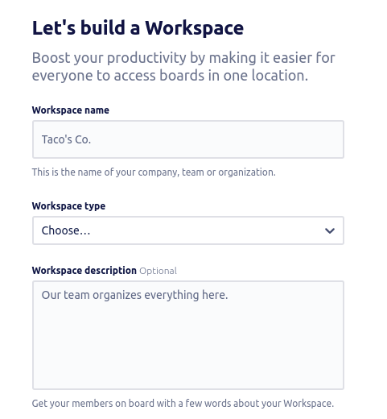
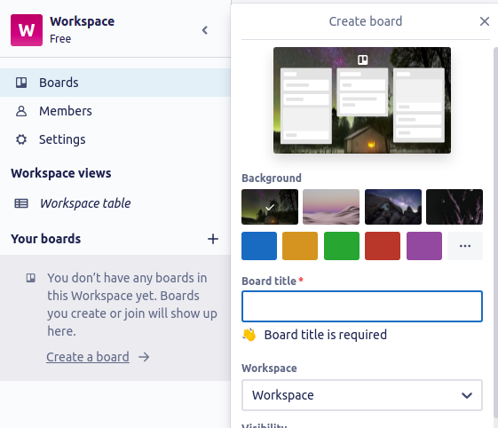
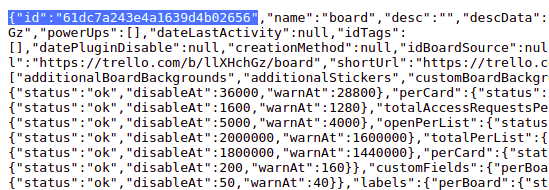
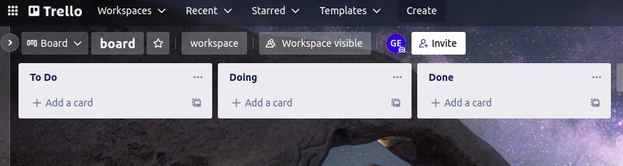
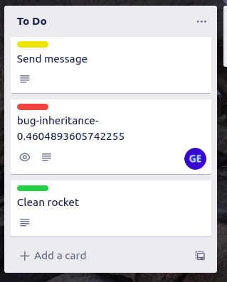

# **Trello-SpaceX API**
---
## Setup
1. create a Trello Account at `https://trello.com/`
---
2. generate an API and a TOKEN keys to be able to use this API
`https://trello.com/app-key`
---
3. create a workspace in the Trello main page
 \
---
4. once you have created your workspace, you must create a new **Board** and select the corresponding workspace 
 \
---
5. congrats, you have created your Board, now, you have to clone this github repository
```python
git clone https://github.com/guidoenr/spacex
```
---
6. the next step is to open the config file called `conf.py` with your favorite text editor.
you will see a file like the following:
```python
# please, complete with the data in : https://trello.com/app-key
credentials = {
    "private": {
        "api_key": "",
        "token": "",
        "id_board": "",
    }
}

# please, complete with the data in : https://trello.com/b/WFPZ8fIc/<BOARD_NAME>.json
workspace = {
    "lists": {
        "id_doing": "",
        "id_done": "", 
        "id_todo": "",
        
    },
    "labels": {
        "id_bug": "",
        "id_issue": "",
        "id_maintenance": "",
        "id_research": "",
        "id_task": "",
        "id_test": "",
    }    
}
```
---
7. as you see, at this step you only have the `credentials` but not the id_board, so please fill all the "private" values with your `api-key` and your `token`. the file will be look like this:
```python
credentials = {
    "private": {
        "api_key": "secret_api_key142130a",
        "token": "secret_token_124741921",
        "id_board": "",
    }
}

...
..
.
```
then, save the file

---
8. to finally fill the `id_board` field, please add `.json` to your current board url, something like this:
```python
https://trello.com/b/pIjpZnOj/newboard.json
```

and search for the `id` field (there will be the first field in the page)
 \
now, please fill that id in the `id_board` field. now you have the credentials complete

---
9. once you putted all the private data in the `conf.py` file, please run the **init_trello.py** script to fill your board settings like the labels, lists, etc.. \
*I recommend to use the **Python 3.9.9** version*
```python
python3.9 init_trello.py
```
---
10. now, you should see your board complete with all the lists:
 \

---
11. as you noticed, you still have to complete the `workspace` settings section in the `conf.py` file, so, 
go again to `trello.com/yourboard.json`
and search for the following fields:
```python
{"id":"61dc7b27cf085280ced0da54","idBoard":"61dc7a243e4a1639d4b02656","name":"Bug","color":"red"},{"id":"61dc7b2800bb9d37c5e8b097","idBoard":"61dc7a243e4a1639d4b02656","name":"Task","color":"blue"},{"id":"61dc7b2965af734d1321debc","idBoard":"61dc7a243e4a1639d4b02656","name":"Issue","color":"yellow"},{"id":"61dc7b2b68ba1817828b8ad3","idBoard":"61dc7a243e4a1639d4b02656","name":"Maintenance","color":"green"},{"id":"61dc7b2c3568fe7d130f1638","idBoard":"61dc7a243e4a1639d4b02656","name":"Research","color":"orange"},{"id":"61dc7b2deda9a74676e25fec","idBoard":"61dc7a243e4a1639d4b02656","name":"Test","color":"purple"}
```
and also for these:
```python
{"id":"61dc7b23ae548a1076c1c9ff","name":"Done"}
{"id":"61dc7b23ae548a1076c1c9ff","name":"Doing"}
{"id":"61dc7b23ae548a1076c1c9ff","name":"To Do"}
```
#### **PLEASE, NOTE THAT THOSE ID'S WILL BE DIFFERENT FROM YOURS**
---

12. finally, complete the `conf.py` file with those values and now you're ready to use the API

---
## **Usage**
## **Run the server**
the app is running on Flask , at `localhost:5000`
so, in order to start the server, please type the following command in your terminal:
```python
python3.9 main.py
```
and you should see an output like the following:
```bash
 * Serving Flask app 'main' (lazy loading)
 * Environment: production
   WARNING: This is a development server. Do not use it in a production deployment.
   Use a production WSGI server instead.
 * Debug mode: off
 * Running on http://127.0.0.1:5000/ (Press CTRL+C to quit)
```
if you had saw this, this step is complete

## **Create a task**
- there are a file called `calls.sh` to perform **curl** requests to the API, with those templates, you can play with the kind of task which you want.

```bash
`calls.sh file`

curl -H "Content-Type: application/json" \
     -d '{"type":"issue","title":"Send message", "description":"Let pilots.."}' \
     http://localhost:5000/create

curl -H "Content-Type: application/json" \
     -d '{"type":"bug","description":"cookpit ..", "description":"Let pilots.."}' \
     http://localhost:5000/create

curl -H "Content-Type: application/json" \
     -d '{"type":"task","title":"Clean rocket", "category":"maintenance"}' \
     http://localhost:5000/create

```

if you run those requests with `bash calls.sh`
you should see in your trello dashboard the following created tasks:
 \
